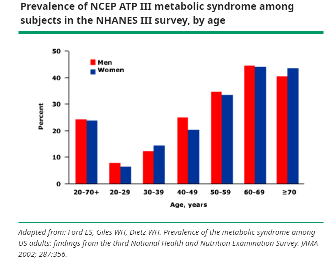
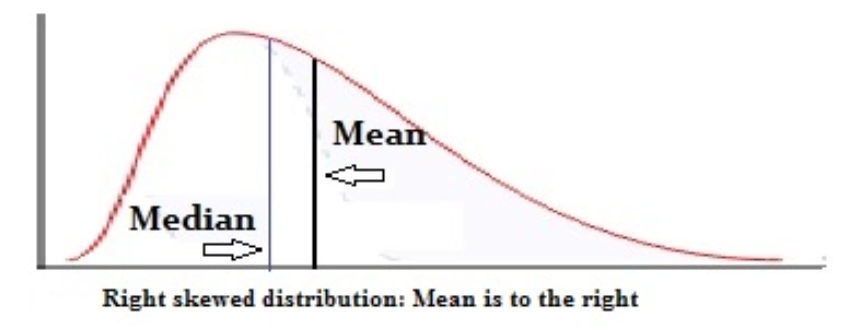

# Load packages

```{r setup, warning=FALSE, message=FALSE}
if (!require(tidyverse)) install.packages("tidyverse")
library(tidyverse) # data management (tidyr, dplyr) and plots (ggplot2)
library(foreign) # reading xport files
library(table1) # generating table 1
library(psych) # describe by group
library(survey) # For using survey weights # survey::svydesign, svymean, svyglm
library(kableExtra)
```

# Data preparation

Code was adapted from [a NHANES tutorials example](https://wwwn.cdc.gov/nchs/data/tutorials/module3_examples_R.r).

## Import data from NHANES page

[NHANES 2017-2018](https://wwwn.cdc.gov/nchs/nhanes/continuousnhanes/default.aspx?BeginYear=2017)

Refer to [R code example](https://wwwn.cdc.gov/nchs/data/tutorials/file_download_import_R.R)

__Interview questionnaires:__

- [Demographics data](https://wwwn.cdc.gov/Nchs/Nhanes/2017-2018/DEMO_J.htm#DMDEDUC2) `~ ((1) in code chunk below)`:
  * SEQN - Respondent sequence number
  * RIAGENDR - Gender
  * RIDAGEYR - Age in years at screening
  * RIDRETH3 - Race/Hispanic origin w/ NH Asian
  * DMDEDUC2 - Education level - Adults 20+
  * DMDMARTL - Marital status
  * Survey design variables: 
    + SDMVPSU - Masked variance pseudo-PSU
    + SDMVSTRA - Masked variance pseudo-stratum
    + WTMEC2YR - Full sample 2 year MEC exam weight
    + WTINT2YR - Full sample 2 year interview weight
         
- [Sleep Duration](https://wwwn.cdc.gov/Nchs/Nhanes/2017-2018/SLQ_J.htm): `~ (2)`  
  * SLD012 - Sleep hours - weekdays or workdays 
  * SLD013 - Sleep hours - weekends
  
- Sitting:
  * [PAD680 - Minutes sedentary activity](https://wwwn.cdc.gov/Nchs/Nhanes/2017-2018/PAQ_J.htm) `~ (3)`
  
- [Questionnaire Data](https://wwwn.cdc.gov/nchs/nhanes/Search/DataPage.aspx?Component=Questionnaire&CycleBeginYear=2017) for treatment prescrition:  
  * [BPQ090D - Told to take prescription for cholesterol](https://wwwn.cdc.gov/Nchs/Nhanes/2017-2018/BPQ_J.htm) `~ (4)`
  * [BPQ040A - Taking prescription for hypertension](https://wwwn.cdc.gov/Nchs/Nhanes/2017-2018/BPQ_J.htm) `~ (4)`
  * [DIQ070 - Take diabetic pills to lower blood sugar](https://wwwn.cdc.gov/Nchs/Nhanes/2017-2018/DIQ_J.htm) `~ (5)`

__MEC Exam__:

- [Examination Data](https://wwwn.cdc.gov/nchs/nhanes/Search/DataPage.aspx?Component=Examination&CycleBeginYear=2017): 
  * [Blood Pressure](https://wwwn.cdc.gov/Nchs/Nhanes/2017-2018/BPX_J.htm) `~ (6)`:
    + BPXSY1 - Systolic: Blood pres (1st rdg) mm Hg
    + BPXDI1 - Diastolic: Blood pres (1st rdg) mm Hg
  * [Body Measures](https://wwwn.cdc.gov/Nchs/Nhanes/2017-2018/BMX_J.htm) `~ (7)`: 
    + BMXWAIST - Waist Circumference (cm)
    
- [Laboratory Data](https://wwwn.cdc.gov/nchs/nhanes/Search/DataPage.aspx?Component=Laboratory&CycleBeginYear=2017):
  * [LBDHDD - Direct HDL-Cholesterol (mg/dL)](https://wwwn.cdc.gov/Nchs/Nhanes/2017-2018/HDL_J.htm#LBDHDD) `~ (8)`
  * [LBXTR - Triglyceride (mg/dL)](https://wwwn.cdc.gov/Nchs/Nhanes/2017-2018/TRIGLY_J.htm#LBXTR) `~ (9)`
  * [LBXGLU - Fasting Glucose (mg/dL)](https://wwwn.cdc.gov/Nchs/Nhanes/2017-2018/GLU_J.htm) `~ (10)`
  
```{r, eval=FALSE}
# function to download the required survey cycles for a component file  
downloadNHANES <- function(fileprefix){
  print (fileprefix)
  outdf <- data.frame(NULL)
  for (j in 1:length(letters)){
    urlstring <- paste('https://wwwn.cdc.gov/nchs/nhanes/',yrs[j],'/',fileprefix,letters[j],'.XPT', sep='')
    download.file(urlstring, tf <- tempfile(), mode="wb")
    tmpframe <- foreign::read.xport(tf)
    outdf <- bind_rows(outdf, tmpframe)
  }
  return(outdf)
}

# Specify the survey cycles required, with corresponding file suffixes
yrs <- c('2017-2018')
letters <- c('_j')

# Download data for each component
# (1) Demographic (DEMO)
DEMO <- downloadNHANES('DEMO') # 9254
# (2) Sleep Disorders
SLQ <- downloadNHANES('SLQ') # 6161
# (3) Physical Activity 
PAQ <- downloadNHANES('PAQ') # 5856
# (4) Blood Pressure & Cholesterol
BPQ <- downloadNHANES('BPQ') # 6161
# (5) Diabetes 
DIQ <- downloadNHANES('DIQ') # 8897
# (6) Blood Pressure
BPX <- downloadNHANES('BPX') # 8704
# (7) Body Measures
BMX <- downloadNHANES('BMX') # 8704
# (8) Cholesterol - High - Density Lipoprotein
HDL <- downloadNHANES('HDL') # 7435
# (9) Cholesterol - Low-Density Lipoproteins (LDL) & Triglycerides (TRIGLY_J)
TRIGLY <- downloadNHANES('TRIGLY') # 3036
# (10) Plasma Fasting Glucose (GLU_J)
GLU <- downloadNHANES('GLU') # 3036
```

We can download each data step-by-step, such as:

```{r, eval=FALSE}
# (1) Demographics - demo and weighting variables

## Create temporary file to catch web data
demofile <- tempfile()

## download data into temporary file using URL; right-click on file name to get URL
## Since we created tempfile, we need to specify it as the destination file
## You can specify other destfile instead and it will save it to your working directory

download.file("https://wwwn.cdc.gov/Nchs/Nhanes/2017-2018/DEMO_J.XPT", 
              destfile = demofile,
              mode = "wb") ### use 'wb' to read as binary file

## Now read the xport data into an R data frame, using foreign package (file must be binary format)
demodf <- read.xport(demofile)  # 9254 obs
```

# Merge datasets 

```{r, eval=FALSE}
# Merging using "piping" 
nhanesdata.merged <- left_join(DEMO, SLQ, by="SEQN") %>% 
  left_join(PAQ, by="SEQN") %>%    
  left_join(BPQ, by="SEQN") %>%      
  left_join(DIQ, by="SEQN") %>% 
  left_join(BPX, by='SEQN') %>% 
  left_join(BMX, by='SEQN') %>%
  left_join(HDL, by='SEQN') %>%
  left_join(TRIGLY, by='SEQN') %>%
  left_join(GLU, by='SEQN') # 9254 obs
```

```{r, eval=FALSE}
saveRDS(nhanesdata.merged, file = "../data/nhanesdata_merged.rds")
```

```{r, eval=FALSE, include=FALSE}
nhanesdata.merged <- readRDS("../data/nhanesdata_merged.rds")
```

# Processing data

Currently, we are not subsetting the data yet. Just the steps of processing data, such steps:

- Subset the in-demand variables   
- Rename to understandable variable names and re-categorize variables  

> Note: @RN796 did not clearly mention data cleaning process

We would wait for the last step to subset data because the [recommendation of NHANES when using weights](https://wwwn.cdc.gov/nchs/nhanes/tutorials/module4.aspx):

|Software   |Improper approaches|	Proper approaches|
|-----------|-------------------|------------------|  
|R ("survey" package)|- Subsetting your data frame before defining your survey design object|- Subsetting your survey design object to preserve the original survey design information</br>- SVYBY function|

```{r, eval=FALSE}
# Select necessary variables
nhanes.vbls <- nhanesdata.merged %>%
  mutate(# create indicator for overall summary
         one = 1) %>% 
  select(SEQN, # Respondent sequence number
         RIDAGEYR, # Age in years at screening
         RIAGENDR, # Gender

         RIDRETH3, # Race/Hispanic origin w/ NH Asian
         DMDMARTL, # Marital status
         DMDEDUC2, # Education level - Adults 20+
         
         # Survey design variables
         SDMVPSU, # Masked variance pseudo-PSU
         SDMVSTRA, # Masked variance pseudo-stratum
         WTMEC2YR, # Full sample 2 year MEC exam weight
         WTINT2YR, # Full sample 2 year interview weight
         
         
         PAD680, # Minutes sedentary activity
         SLD012, # Sleep hours - weekdays or workdays
         SLD013, # Sleep hours - weekends
         
         BPXSY1, # Systolic: Blood pres (1st rdg) mm Hg
         BPXDI1, # Diastolic: Blood pres (1st rdg) mm Hg
         BPXSY2, # Systolic: Blood pres (2nd rdg) mm Hg
         BPXDI2, # Diastolic: Blood pres (2nd rdg) mm Hg
         BPXSY3, # Systolic: Blood pres (3rd rdg) mm Hg
         BPXDI3, # Diastolic: Blood pres (3rd rdg) mm Hg
         BPXSY4, # Systolic: Blood pres (4th rdg) mm Hg
         BPXDI4, # Diastolic: Blood pres (4th rdg) mm Hg
         LBXGLU, # Fasting Glucose (mg/dL)
         LBDHDD, # Direct HDL-Cholesterol (mg/dL)
         LBXTR, # Triglyceride (mg/dL)
         BMXWAIST, # Waist Circumference (cm)
         
         BPQ090D, # Told to take prescription for cholesterol
         BPQ040A, # Taking prescription for hypertension
         DIQ070 # Take diabetic pills to lower blood sugar
         ) %>%
  mutate(# create indicator for overall summary
         one = 1,
         
         id = SEQN,
         psu = SDMVPSU, strata = SDMVSTRA, 
         persWeight = WTINT2YR, persWeightMEC= WTMEC2YR,
         age = RIDAGEYR,
         # Create age categories for adults aged 18 and over: ages 18-39, 40-59, 60 and over
        ageCat = cut(RIDAGEYR,
                    breaks = c(19, 29, 39, 49, 59, 69, Inf),
                    labels = c('20-29','30-39', '40-49', '50-59', '60-69', '70+')),
         female = factor(if_else(RIAGENDR == 1, 0, 1)), # 1:male ==> 0
         ethnicity = case_when(
           RIDRETH3 %in% c(1,2) ~ 0, # Hispanic
           RIDRETH3 == 3 ~ 1, # Non-Hispanic White
           RIDRETH3 == 4 ~ 2, # Non-Hispanic Black
           RIDRETH3 == 6 ~ 3, # Non-Hispanic Asian
           RIDRETH3 == 7 ~ 4, # Multi-Racial
         is.na(RIDRETH3) ~ NA_real_
         ),
         married = case_when(
           DMDMARTL == 5 ~ 0, # Never married
           DMDMARTL %in% c(1,6) ~ 1, #  Married or Living with partner
           DMDMARTL == 2 ~ 2, # Widowed
           DMDMARTL %in% c(3,4) ~ 3, # Divorced or Separated
           DMDMARTL %in% c(77,99) ~ NA_real_
           #DMDMARTL %in% c(77,99,.) ~ NA_real_
         ),
         edu = case_when(
           DMDEDUC2 == 1 ~ 0, # Less than 9th grade
           DMDEDUC2 == 2 ~ 1, # 9-11th grade
           DMDEDUC2 == 3 ~ 2, # High school
           DMDEDUC2 == 4 ~ 3, # Some college
           DMDEDUC2 == 5 ~ 4, # >= College graduate
           DMDEDUC2 %in% c(7,9) ~ NA_real_
         ), 
         chol.prsn = case_when(
           BPQ090D == 2 ~ 0, # No
           BPQ090D == 1 ~ 1, # Yes
           BPQ090D %in% c(7,9) ~ NA_real_
         ),
         bp.prsn = case_when(
           BPQ040A == 2 ~ 0, # No
           BPQ040A == 1 ~ 1, # Yes
           BPQ040A %in% c(7,9) ~ NA_real_
         ),
         glu.prsn = case_when(
           DIQ070 == 2 ~ 0, # No
           DIQ070 == 1 ~ 1, # Yes
           DIQ070 %in% c(7,9) ~ NA_real_
         ),
         sit = PAD680,
         sleep = rowMeans(.[, c("SLD012","SLD013")], na.rm = TRUE),
         dia = rowMeans(.[, c("BPXDI1","BPXDI2","BPXDI3","BPXDI4")], na.rm = TRUE),
         sys = rowMeans(.[, c("BPXSY1","BPXSY2","BPXSY3","BPXSY4")], na.rm = TRUE),
         glu = LBXGLU,
         hdl = LBDHDD,
         tri = LBXTR,
         waist = BMXWAIST
        ) %>%
  select(one, id, psu, strata, persWeight, persWeightMEC, age, ageCat, female, ethnicity, married, edu, sit, sleep, sys, dia, glu, hdl, tri, waist, bp.prsn, chol.prsn, glu.prsn) # 9254
```


# Define metabolic syndrome

According to @RN795, the presence of any 3 of 5 risk factors constitutes a diagnosis of metabolic syndrome: 

1)	elevated waist circumference (≥88 cm for women and ≥102 cm for men),  
2)	elevated triglycerides (≥150 mg/dL) or drug treatment for elevated triglycerides *(there was no variable indicating the medication for lower triglycerides)*,  
3)	low HDL cholesterol (<40 mg/dL for men and <50 mg/dL for women) or drug treatment for low HDL cholesterol,  
4)	elevated blood pressure (systolic ≥130 mm Hg, or diastolic ≥85 mm Hg, or both) or antihypertensive drug treatment for a history of hypertension, and 
5)	elevated fasting glucose (≥100 mg/dL) or drug treatment for elevated glucose.” (Moore et al., 2017; Preventing Chronic Disease). 


```{r, eval=FALSE}
nhanes.MetS <- nhanes.vbls %>%
  mutate(waist.ind = case_when(waist >= 88  & female == 1 ~ 1, #condition 1
                               waist >= 102 & female == 0 ~ 1, #condition 2
                               is.na(waist) | is.na(female) ~ NA_real_, #condition 3
                               TRUE ~ 0), #all other cases
         tri.ind = case_when(tri >= 150 | chol.prsn == 1 ~ 1,
                             is.na(tri) ~ NA_real_,
                             TRUE ~0),
         hdl.ind = case_when((hdl < 40 & female == 0) | chol.prsn == 1 ~ 1,
                             (hdl < 50 & female == 1) | chol.prsn == 1 ~ 1,
                             is.na(hdl) | is.na(female) ~ NA_real_,
                             TRUE ~ 0),
         bp.ind = case_when(sys >= 130 | dia >= 85 | bp.prsn == 1 ~ 1,
                            is.na(sys) & is.na(dia) ~ NA_real_,
                            TRUE ~ 0
                            ),
         glu.ind = case_when(glu >= 100 | glu.prsn == 1 ~ 1,
                             is.na(glu) ~ NA_real_,
                             TRUE ~ 0)
         ) # 9254 obs


nhanes.MetS$mets.sum = rowSums(nhanes.MetS[24:28], na.rm = T) # from waist.ind to glu.ind # 24:28
nhanes.MetS$mets.sum[rowSums(!is.na(nhanes.MetS[24:28])) == 0] <- NA # return NA if all indicators are NA
nhanes.MetS$ind.non_missing <- !rowSums(!is.na(nhanes.MetS[24:28])==0) # create an indicator in which none of criteria is none NA
nhanes.MetS$mets.ind <- ifelse(nhanes.MetS$mets.sum >= 3, 1, 0) # 9254 obs
```

# Define sub-population of interest 

- `age` of 20+
  Reasons for the consistency in comparison:  
  @RN801 used NHANES III, 1988 to 1994 based on 2001 Adult Treatment Panel III (ATP III) criteria (same as Moore et al.) with age groups.  
  
  
  
  @RN796 did not specify the age range but they used the same criteria for adults (e.g. "Metabolic syndrome was defined according to NCEP ATPIII (National Cholesterol Education Program Adult Treatment Panel III) criteria.").

- @RN796 described exclusion criteria to remove potential outliers, which must be applied. Specifically, subjects who reported sleep durations greater than mean + 2SD   (two standard deviations) were excluded. 

```{r, eval=FALSE}
sleep.mean <- mean(nhanes.MetS$sleep, na.rm = TRUE)
sleep.sd <- sd(nhanes.MetS$sleep, na.rm = TRUE)

nhanes.MetS <- nhanes.MetS %>% 
  mutate(
    #  Define sub-population of interest 
    inAnalysis= (age >=20 & ind.non_missing & ((sleep.mean-2*sleep.sd)<sleep) & (sleep<(sleep.mean+2*sleep.sd)))) # 9254 obs
```


```{r, eval=F}
saveRDS(nhanes.MetS, file = "../data/nhanesMetS.rds")
```

```{r, include=FALSE}
nhanes.MetS <- readRDS(file = "../data/nhanesMetS.rds")
```

Our sample size would be `r table(nhanes.MetS$inAnalysis)[[2]]`

# Checking the MetS prevalence in the random sample (unweighted)
  
With all `age` *groups*:

```{r}
nhanes.MetS %>%
  filter(!is.na(mets.ind)) %>% 
  group_by(mets.ind) %>% 
  summarise(n=n()) %>% 
  mutate(prop=round(n/sum(n)*100,1)) %>%
  kbl(col.names = c('Metabolic syndrome', 'Freq', 'Percent')) %>% 
  kable_material(c("striped", "hover"))
```

With `age` 18+:

```{r}
nhanes.MetS %>% 
  filter(age>=18 & !is.na(mets.ind)) %>% 
  group_by(mets.ind) %>% 
  summarise(n=n()) %>% 
  mutate(prop=round(n/sum(n)*100,1)) %>%
  kbl(col.names = c('Metabolic syndrome', 'Freq', 'Percent')) %>% 
  kable_material(c("striped", "hover"))
```  
 
With `age` 20+:

```{r}
nhanes.MetS %>% 
  filter(age>=20 & !is.na(mets.ind)) %>% 
  group_by(mets.ind) %>% 
  summarise(n=n()) %>% 
  mutate(prop=round(n/sum(n)*100,1)) %>%
  kbl(col.names = c('Metabolic syndrome', 'Freq', 'Percent')) %>% 
  kable_material(c("striped", "hover"))
```  

With `age` 20+ and `ind.non_missing` is TRUE:

```{r}
nhanes.MetS %>% 
  filter(age>=20 & ind.non_missing) %>% 
  group_by(mets.ind) %>% 
  summarise(n=n()) %>% 
  mutate(prop=round(n/sum(n)*100,1)) %>%
  kbl(col.names = c('Metabolic syndrome', 'Freq', 'Percent')) %>% 
  kable_material(c("striped", "hover"))
```  

# Checking the MetS prevalence with weighted

~~~
Note:  
psu = SDMVPSU, 
strata = SDMVSTRA, 
persWeight = WTINT2YR, 
persWeightMEC= WTMEC2YR
~~~

```{r}
# Define survey design for overall dataset 
NHANES_all <- svydesign(data=nhanes.MetS, id=~psu, strata=~strata, weights=~persWeightMEC, nest=TRUE)
# Create a survey design object for the subset of interest 
# Subsetting the original survey design object ensures we keep the design information about the number of clusters and strata
NHANES <- subset(NHANES_all, inAnalysis==1)
```

```{r}
#' Proportion and standard error, for adults aged 20 and over
svyby(~mets.ind, ~one, NHANES, svymean) %>% mutate(mets.ind = round(mets.ind*100, digits=1), se=round(se*100, digits=1))
```

```{r}
#' Proportion and standard error, for adults age groups
svyby(~mets.ind, ~ageCat, NHANES, svymean) %>% mutate(mets.ind = round(mets.ind*100, digits=1), se=round(se*100, digits=1))
```

```{r}
#' Proportion and standard error, for adults aged 20+ by race and Hispanic origin
svyby(~mets.ind, ~ethnicity, NHANES, svymean) %>% mutate(mets.ind = round(mets.ind*100, digits=1), se=round(se*100, digits=1))
```


# Table 1

Since we mimic the Table 1 of @RN796 in which they used the random sample (unweighted). Here I use the same context.
```{r}
df <- nhanes.MetS %>% filter(inAnalysis)
```

We will use the [table1: Tables of Descriptive Statistics in HTML](https://cran.r-project.org/web/packages/table1/) of Benjamin Rich

## Table with overall and subgroups

```{r}
df$female <- factor(df$female, levels=c(0,1),
                    labels=c("Male", "Female"))
df$ethnicity <- factor(df$ethnicity, levels=c(0,1,2,3,4),
                    labels=c("Hispanic", "White", "Black", "Asian", "Multiracial"))
df$married <- factor(df$married, levels=c(0,1,2,3),
                    labels=c("Never married", "Married or Living with partner", "Widowed", "Divorced or Separated"))
df$edu <- factor(df$edu, levels=c(0,1,2,3,4),
                    labels=c("Less than 9th grade", "9-11th grade", "High school", "Some college", ">= College graduate"))
df$mets.ind <- factor(df$mets.ind, levels=c(0,1),
                    labels=c("No", "Yes"))
label(df$age) <- "Age"
label(df$female) <- "Sex"
label(df$ethnicity) <- "Ethnicity"
label(df$married) <- "Marital Status"
label(df$edu) <- "Education"
label(df$sit) <- "Sitting"
label(df$sleep) <- "Sleep Duration"
label(df$dia) <- "Diastolic Blood Pressure"
label(df$sys) <- "Systolic Blood Pressure"
label(df$glu) <- "Fasting Blood Glucose"
label(df$hdl) <- "High Density Lipoprotein"
label(df$tri) <- "Triglyceride"
label(df$waist) <- "Waist Circumference"
label(df$mets.ind) <- "Metabolic Syndrome"
```


```{r}
strata <- c(list(Total=df), split(df, df$mets.ind))
labels <- list(
  variables=list(age=render.varlabel(df$age),
                 female=render.varlabel(df$female),
                 ethnicity=render.varlabel(df$ethnicity),
                 married=render.varlabel(df$married),
                 edu=render.varlabel(df$edu),
                 sit=render.varlabel(df$sit),
                 sleep=render.varlabel(df$sleep),
                 dia=render.varlabel(df$dia),
                 sys=render.varlabel(df$sys),
                 glu=render.varlabel(df$glu),
                 hdl=render.varlabel(df$hdl),
                 tri=render.varlabel(df$tri),
                 waist=render.varlabel(df$waist)),
    groups=list("", "Metabolic Syndrome"))

table1(strata, labels, groupspan=c(1, 2), topclass="Rtable1-zebra",
       render.continuous=c(.="Mean (SD)", .="Median [Q1, Q3]"))


```


We can exclude missing by [option](https://github.com/benjaminrich/table1/issues/21) `render.missing=NULL` in the table1 syntax

```{r, include=FALSE}
tab1 <- table1(strata, labels, groupspan=c(1, 2), topclass="Rtable1-zebra",
       render.continuous=c(.="Mean (SD)", .="Median [Q1, Q3]"))
save(tab1, file = "../data/tab1.rds")
```


## Table 1 with p-value

```{r}
pvalue <- function(x, ...) {
    # Construct vectors of data y, and groups (strata) g
    y <- unlist(x)
    g <- factor(rep(1:length(x), times=sapply(x, length)))
    if (is.numeric(y)) {
        # For numeric variables, perform a standard 2-sample t-test
        p <- t.test(y ~ g)$p.value
    } else {
        # For categorical variables, perform a chi-squared test of independence
        p <- chisq.test(table(y, g))$p.value
    }
    # Format the p-value, using an HTML entity for the less-than sign.
    # The initial empty string places the output on the line below the variable label.
    c("", sub("<", "&lt;", format.pval(p, digits=3, eps=0.001)))
}
```

```{r}
table1(~ age + female + ethnicity + married + edu + sit + sleep + dia + sys + glu + hdl + tri + waist| mets.ind, data=df, overall=F, extra.col=list(`P-value`=pvalue), render.continuous=c(.="Mean (SD)", .="Median [Q1, Q3]"))
```

## Regular way

We can generate Table 1 using simpler syntax: `mean`, `sd`, `describe`, `describeBy`, `t.test` for numeric and `table`, `prop.table` and `chisq.test` for factor variables.

### Numeric variable

#### With non-missing variable

```{r}
mean(df$age)
sd(df$age)
sum(is.na(df$age)) #check missing
describe(df$age)
describeBy(df$age, group=df$mets.ind)
t.test(df$age ~ df$mets.ind)
```

#### With missing variable

```{r}
sum(is.na(df$sit)) #check missing
mean(df$sit, na.rm = TRUE)
sd(df$sit, na.rm = TRUE)

describe(df$sit) # na.rm=TRUE: default
describeBy(df$sit, group=df$mets.ind)
t.test(df$sit ~ df$mets.ind)
```

### Factor variable

```{r}
sum(is.na(df$married))

table(df$married)
table(df$married, useNA = "always")
prop.table(table(df$married))
prop.table(table(df$married, useNA = "always"))

table(df$mets.ind, df$married)
table(df$mets.ind, df$married, useNA = "always")
prop.table(table(df$mets.ind, df$married), 1)
prop.table(table(df$mets.ind, df$married, useNA = "always"), 1)
chisq.test(table(df$mets.ind,df$married),correct=FALSE)
```


# Metabolic syndrome prevalence

@RN796 reported about 31.5% (793/2528) had metabolic syndrome using the 2013/2014 National Health and Nutrition Examination Survey (NHANES). Throughout our analysis on 2017/2018 NHANES, there was about 42-44% (even 58% if we omitted cases when existed missing in one of indicators of metabolic syndrome) had metabolic syndrome.

When applying the survey weights, the metabolic syndrome prevalence is about 51%. Significantly, its distribution vastly varied among the age groups: more increase of age, the more increasing cases of metabolic syndrome.

It showed the consistent rising of the metabolic syndrome throughout this period (6 years from 2013 to 2018). The phenomenon reflected the correct trends similar as the metabolic syndrome prevalence increased from 1988 to 2012 by @RN797 (34.2%), 1988-1994 by @RN801 (22%), and 2011-2016 by @RN800 (34.7%).

If it is expected that MetS prevalence remains consistent across years, we can be said about the sensitivity/specificity of the criteria described above compared to the method used by the authors: we got the perfect sensitivity but the specificity would be = 31.5/51 = 62%. One may argue that @RN796 defined MetS using the criteria established by @RN799, which considers racial and age-specific differences in populations, resulting in a complex formula to determine a score. Therefore, the method was strictly conservative in detecting metabolic syndrome. However, the more-than-20% go-up may be seen as a significant gap caused by the measurements between @RN795 and @RN799.

Otherwise, the prevalence of Metabolic syndrome is also on the rise. And we should be aware of this situation.


# Right-skewed

When? Mean > Median, usually see in medical studies.



Simply, look at table 1 above, it happened in such variables in the study:

- Sitting
- Fasting Blood Glucose
- High Density Lipoprotein
- Triglyceride
- Waist Circumference

We would report for them the appropriate measures of centrality and dispersion of *`MEDIAN`, [Q1, Q3]*.

# References